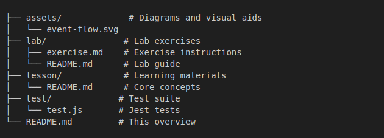

# :mortar_board: JavaScript Event Flow & Delegation Lab
## :dart: What You'll Learn

In this hands-on lab, you'll master two crucial concepts in JavaScript DOM events:

**Event Flow** - Understanding how events travel through the DOM:

- Capturing phase (top → down)

- Target phase (element itself)

- Bubbling phase (bottom → up)

- Event Delegation - Writing efficient event handlers:

- Handle multiple elements with a single listener

- Manage dynamically added elements automatically

- Improve performance and memory usage

## :books: Lab Content

- Lesson:
   - Covers DOM event flow and delegation, including:

   - DOM Event Flow: Capturing → Target → Bubbling phases

   - Why Phases Matter: Using stopPropagation() and preventDefault()

   - Event Delegation: Attaching a single listener to a parent to handle dynamic child elements

   - Example Delegated Click Handler: Using event.target and closest()

   - Common Pitfalls & Tips: Avoid mistakes with nested elements and memory leaks
- Visual Diagrams: Clear illustrations of event phases

- Hands-on Exercise: Implement delegation patterns yourself

- Test Suite: Verify your implementation works correctly

## :world_map: Lab Structure

**Note**: The exercise instructions and steps are handled in lab/exercise.md.

## :video_game: Getting Started

- Clone this project

- Read the Lesson

- Start with lesson/README.md for core concepts

- Review the event flow diagram in assets/

- Run the Demo

- Open lab/index.html in your browser

- Or use Live Server in VS Code for automatic reloads

- Test Your Work

- Manual testing: Use the browser DevTools console

- Automated testing: Run the test suite in test/test.js

## :dart: Learning Objectives

By completing this lab, you'll be able to:

- Understand event capturing, target, and bubbling phases

- Use stopPropagation() and preventDefault() effectively

- Implement efficient event delegation patterns

- Handle dynamic content with minimal event listeners

- Debug event flow using browser DevTools