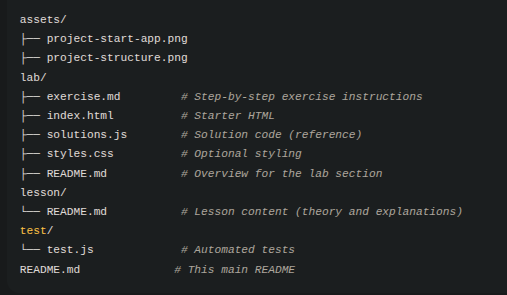

# JavaScript Event Flow & Delegation Lab
##  What You'll Learn

In this hands-on lab, you'll master two crucial concepts in JavaScript DOM events:

**Event Flow** - Understanding how events travel through the DOM:

- Capturing phase (top → down)

- Target phase (element itself)

- Bubbling phase (bottom → up)

- Event Delegation - Writing efficient event handlers:

- Handle multiple elements with a single listener

- Manage dynamically added elements automatically

- Improve performance and memory usage

## Lab Content

- Lesson:
   - Covers DOM event flow and delegation, including:

   - DOM Event Flow: Capturing → Target → Bubbling phases

   - Why Phases Matter: Using stopPropagation() and preventDefault()

   - Event Delegation: Attaching a single listener to a parent to handle dynamic child elements

   - Example Delegated Click Handler: Using event.target and closest()

   - Common Pitfalls & Tips: Avoid mistakes with nested elements and memory leaks
- Visual Diagrams: Clear illustrations of event phases

- Hands-on Exercise: Implement delegation patterns yourself

## Lab Structure

## Getting Started

- Clone this project [w2_js_event_flow_delegation](https://github.com/onja-org/w2_js_event_flow_delegation)

- Read the Lesson

- Start with lesson/README.md for core concepts

- Review the event flow diagram in assets

- Run the Demo

- Open lab/index.html in your browser

- Or use Live Server in VS Code for automatic reloads

- Test Your Work

- Manual testing: Use the browser DevTools console

## Learning Objectives

By completing this lab, you'll be able to:

- Understand event capturing, target, and bubbling phases

- Use stopPropagation() and preventDefault() effectively

- Implement efficient event delegation patterns

- Handle dynamic content with minimal event listeners

- Debug event flow using browser DevTools